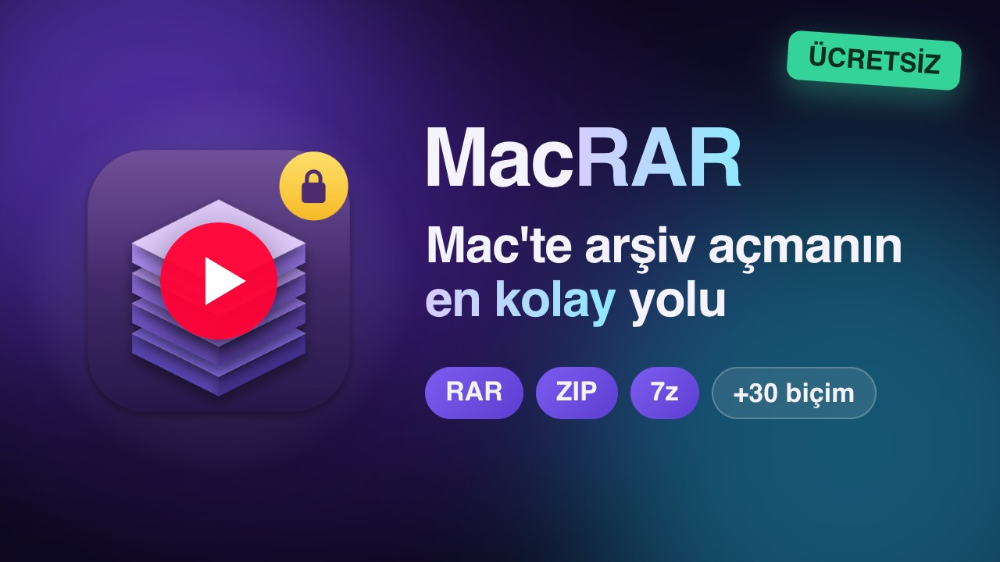
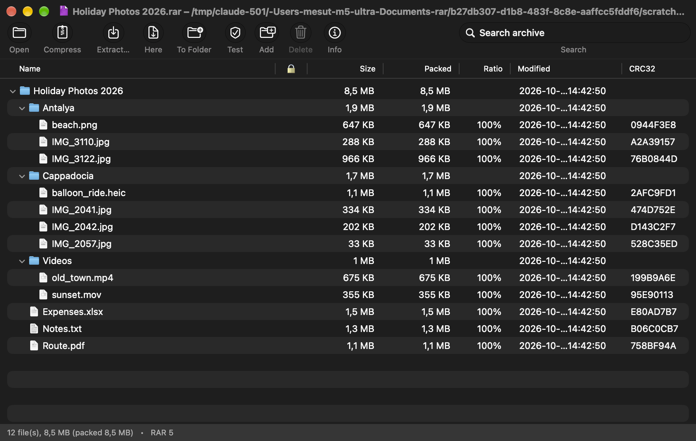
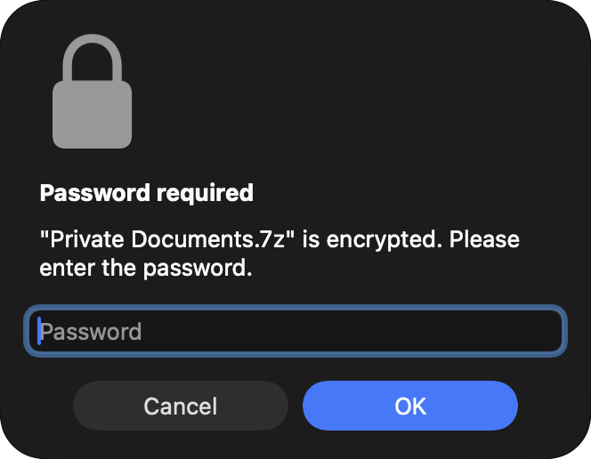
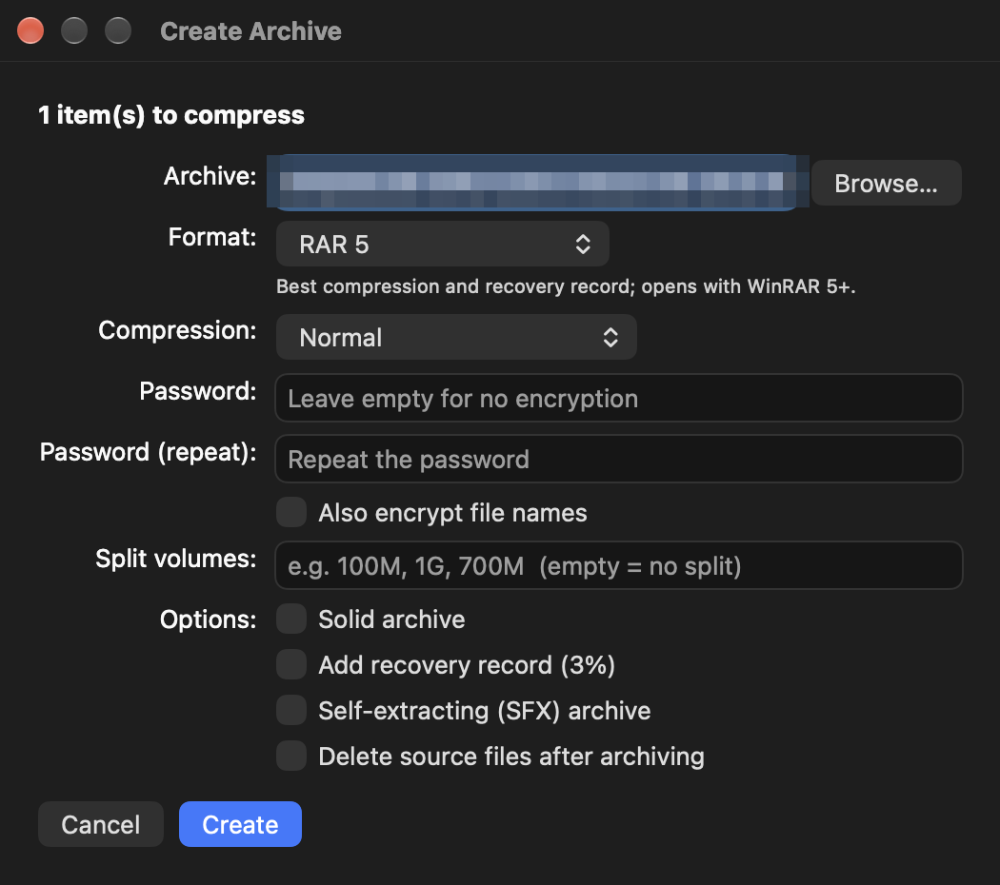
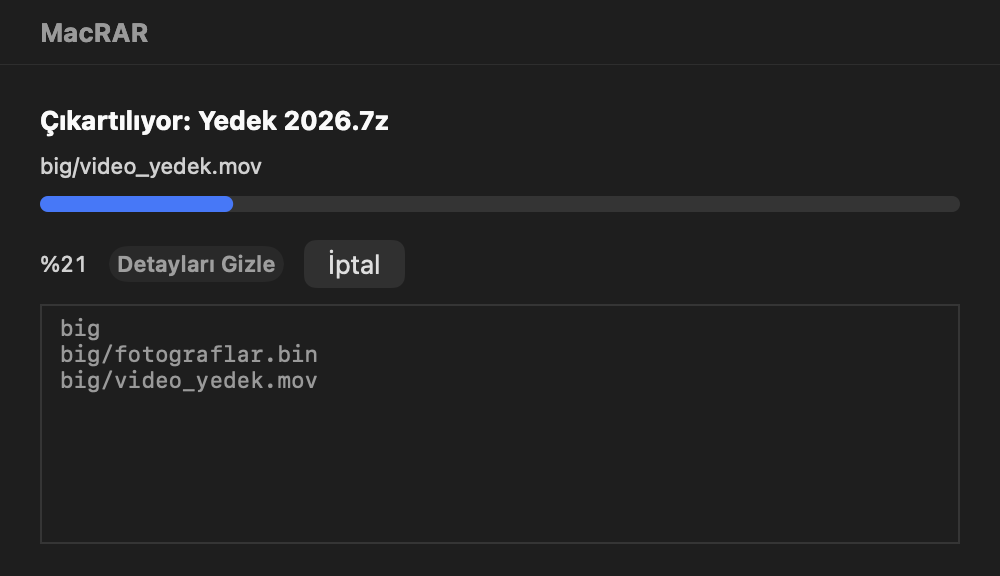

<p align="center">
  
</p>

<h1 align="center">MacRAR</h1>

<p align="center">
  A WinRAR-style archive manager for macOS, built on the official <code>7zz</code> build of 7-Zip, with optional RAR creation through RARLAB's own <code>rar</code> tool.<br>
  Native AppKit UI · Finder right-click menu · encrypted archives · multi-volume archives · 30+ formats
</p>

<p align="center">
  <a href="README.tr.md">🇹🇷 Türkçe açıklama için tıklayın</a>
</p>

<p align="center">
  <a href="https://youtu.be/3pT3mBTTk98"></a><br>
  <sub>▶ 1-minute intro video on YouTube (Turkish narration, subtitled)</sub>
</p>

---

## Why

macOS has no native way to open `.rar` files, and the few GUI tools around either hide what they are doing or cannot handle encrypted or multi-part archives well. MacRAR wraps Igor Pavlov's `7zz` engine (and, if you install it, RARLAB's `rar` for creating RAR archives) in a small native app that behaves like WinRAR on Windows: double-click to browse, right-click in Finder to extract or compress, drag files out of the archive window, get asked for a password only when one is actually needed.

The whole app is a few thousand lines of Swift, needs no Xcode project (Command Line Tools are enough) and carries no third-party frameworks.

## Screenshots

| Browsing a RAR archive | Encrypted ZIP (lock column) |
|---|---|
|  |  |

| Password prompt | Create archive dialog | Progress with details |
|---|---|---|
|  |  |  |

## Features

**Browsing**
- Opens an archive as a folder tree: name, lock indicator, size, packed size, ratio, modification date, CRC. Click a header to sort; widths and sort order are remembered.
- Search field filters the whole archive by path.
- Double-click or press Return to open a file with its default app; press Space for a Quick Look preview.
- File → Open Recent, View → Expand All / Collapse All / Refresh / Show Archive in Finder.
- Settings (⌘,): default format and level for quick compression, Finder reveal behaviour, update check, interface language.
- Status bar shows file count, total and packed size, format and flags (solid, encrypted headers, volumes).

**Extracting**
- Extract here (⌘E), extract to a folder named after the archive (⌥⌘E), extract to a chosen folder (⇧⌘E), or extract only the selected items.
- If the destination already contains items with the same names you are asked whether to overwrite, auto-rename, or cancel.
- Drag items from the archive window onto a Finder folder or the Desktop: MacRAR asks once, then extracts the dragged items there with a progress window.
- Progress window with overall percentage, estimated remaining time, elapsed time, the current file, and a collapsible log of processed files.

**Encrypted archives**
- RAR archives with encrypted file data or encrypted headers (`-hp`), 7z with encrypted headers (`-mhe`), ZIP with ZipCrypto or AES.
- The password is requested only when it is actually required, re-requested if wrong, and remembered for the rest of the session with that archive.

**Multi-volume archives**
- RAR `.part01.rar … .partNN.rar`, 7z and ZIP `.001 … .NNN` sets are recognised. Selecting all parts in Finder and running a Quick Action processes the set once, starting from the first volume.

**Creating archives**
- Formats: 7z, ZIP, TAR, TAR.GZ, TAR.XZ, TAR.BZ2 out of the box; RAR 5 once you point the app at your own copy of RARLAB's "RAR for macOS" (Settings → *Install RAR Tool…*, or just pick RAR when creating an archive and follow the steps).
- Six compression levels, password (optional file-name encryption for RAR and 7z, AES-256 for 7z and ZIP), solid archives, recovery record (RAR), split volumes, SFX (RAR), delete sources after archiving.
- Options the chosen format cannot support are disabled automatically.
- Add files to an existing RAR/7z/ZIP/TAR archive (drag files onto the window or use ⇧⌘A) and delete entries from it (⌘⌫).

**Languages**
- The interface is in English or Turkish, following the system language (or the per-app language chosen in System Settings → General → Language & Region). `MACRAR_LANG=tr|en` overrides it.

**Updates**
- Once a day MacRAR checks GitHub Releases for a newer version and offers to download it; *MacRAR → Check for Updates…* runs the check on demand. Set `MACRAR_NO_UPDATE_CHECK=1` to disable it.

**Finder integration**
- Right-click menu in Finder: *Open with MacRAR*, *MacRAR: Extract Here*, *MacRAR: Extract to Folder* (shown for archives) and *Compress with MacRAR…* (shown for any selection) appear directly in the context menu; *Extract To…*, *Test* and *Quick Compress* (default format from Settings, no dialog) live in the *Quick Actions* submenu. They are installed automatically the first time the app runs from Applications; *MacRAR → (Re)install Finder Quick Actions* repairs them.
- Registers as the owner of `.rar` and as an alternate handler for ZIP, 7z, TAR, GZ, BZ2, XZ, ZST, CAB, ISO and more, so they appear in *Open With*. On first launch a *File Associations* dialog lets you pick which types should open with MacRAR; it is always available from the app menu.
- If you launch MacRAR from the DMG or from Downloads it offers to move itself to Applications, because the Finder menu and the associations only work from there.

## Supported formats

| Operation | Formats |
|---|---|
| Open / extract / test | RAR (all versions, multi-volume), ZIP/ZIPX, 7z (including `.7z.001` sets), TAR, GZ/TGZ, BZ2, XZ, ZST, LZ4, LZMA, Z, CAB, ARJ, LZH, CPIO, ISO, WIM, DEB, RPM, JAR/APK, MSI, CHM, XAR/PKG, DMG, VHD/VMDK and everything else 7-Zip can read |
| Create | 7z, ZIP, TAR, TAR.GZ, TAR.XZ, TAR.BZ2; RAR 5 with your own RARLAB `rar` |
| Add / delete entries | 7z, ZIP, TAR (not the compressed tar variants); RAR with your own RARLAB `rar` |
| Passwords | RAR and 7z: data and file names (AES-256); ZIP: data (AES-256) |

Everything is read, extracted and tested with the bundled `7zz` (including RAR, via 7-Zip's unRAR code). Creating or modifying RAR archives runs RARLAB's `rar`, which the app does not bundle. Compressed tar archives (`tar.gz`, `tar.xz`, …) are handled with a two-stage pipeline, outer decompressor piped into the tar reader, so their contents are listed directly.

## Editions

| | Easy Mac Archiver (Mac App Store) | MacRAR (GitHub) |
|---|---|---|
| Price | $0.99 | free |
| Open / extract RAR, ZIP, 7z, TAR, ISO… | ✓ | ✓ |
| Create ZIP, 7z, TAR(.gz/.xz/.bz2) | ✓ | ✓ |
| Create / modify RAR | — (proprietary format) | ✓ with your own copy of RARLAB's RAR for macOS |
| Finder right-click menu | ✓ (app services) | ✓ (Quick Actions) |
| Sandboxed | ✓ (asks once for folder access) | — |
| Automatic updates | App Store | daily GitHub check |

[Privacy policy](PRIVACY.md) · [Support](SUPPORT.md)

## Download

Ready-made, Developer ID-signed and Apple-notarized builds are on the [Releases page](https://github.com/mstcvk/MacRAR/releases/latest): open the DMG, drag MacRAR into Applications and launch it. The first launch installs the Finder right-click menu and asks which file types should open with MacRAR. No Gatekeeper warnings.

With [Homebrew](https://brew.sh):

```bash
brew install --cask mstcvk/tap/macrar
```

`brew upgrade --cask macrar` updates it; the cask lives in [mstcvk/homebrew-tap](https://github.com/mstcvk/homebrew-tap) and always points at the latest notarized DMG.

Since 1.4 the app bundles only the 7-Zip engine (universal: Apple Silicon and Intel). RARLAB's `rar`/`unrar` are no longer included because their licence does not allow redistributing `rar`. RAR archives are opened with 7-Zip; to create RAR archives, MacRAR walks you through downloading "RAR for macOS" from rarlab.com and pointing the app at it.

## Requirements

- macOS 13 Ventura or newer, Apple Silicon or Intel (universal binary).
- To build from source: Xcode Command Line Tools (`xcode-select --install`). A full Xcode is not needed.
- Only for *creating* RAR archives: RARLAB's "RAR for macOS" (paid, 40-day trial), which the app helps you download and install. Opening, extracting and testing RAR archives is free and unlimited through 7-Zip; 7z/ZIP/TAR creation is free.

## Build and install

```bash
git clone https://github.com/mstcvk/MacRAR.git
cd MacRAR
./fetch-tools.sh      # downloads 7zz from 7-zip.org into tools/
./build.sh install    # compiles, installs /Applications/MacRAR.app, registers Finder Quick Actions
```

`./build.sh` alone only builds `build/MacRAR.app`. The install step never kills a running MacRAR; if an extraction is in progress it waits for the app to quit.

The `7zz` binary is **not** part of this repository. `fetch-tools.sh` downloads it from its official source so that its licence stays with its author. RARLAB's `rar` is never bundled; the app installs a copy the user downloads into `~/Library/Application Support/MacRAR/rar`.

After installing:
- To choose which file types open with MacRAR: MacRAR menu → *File Associations…* (also shown once on first launch).
- If the Quick Actions do not show up in Finder: System Settings → General → Login Items & Extensions → Finder (Quick Actions) and enable them.

### Code signing

`build.sh` produces an ad-hoc signed app that runs on the Mac it was built on. If you pass that `.app` to someone else, Gatekeeper will complain; they can right-click → Open once, or run `xattr -cr /Applications/MacRAR.app`.

For a build that opens anywhere without warnings, `release.sh` signs with a Developer ID certificate, submits the app to Apple's notary service, staples the ticket and writes `dist/MacRAR-<version>.zip`. It needs an Apple Developer Program membership, a "Developer ID Application" certificate (Xcode → Settings → Accounts → Manage Certificates…) and a `notarytool` keychain profile:

```bash
xcrun notarytool store-credentials MacRAR --apple-id you@example.com --team-id TEAMID
./release.sh
```

## Command-line modes

The Quick Actions launch the app like this:

```bash
open -n -a /Applications/MacRAR.app --args --extract-here /path/archive.rar
```

| Flag | Effect |
|---|---|
| `--extract-here` | extract next to the archive |
| `--extract-folder` | extract into a folder named after the archive |
| `--extract-to` | ask for a destination folder once, then extract |
| `--test` | test the archive and report |
| `--compress` | create an archive with the default format and level from Settings, no dialog |
| `--compress-dialog` | open the Create Archive dialog |
| `--set-default` | make MacRAR the default app for `.rar` |
| `--install-quick-actions` | (re)install the Finder Quick Actions |

## Project layout

```
Sources/RarEngine.swift      process runner, format detection, 7zz listing parser, pipelines, progress parsing
Sources/Operations.swift     extract / test / compress / add / delete with password retry loops
Sources/ArchiveWindow.swift  main window: outline view, toolbar, search, drag & drop, file promises
Sources/Dialogs.swift        password / overwrite prompts, progress window, Create Archive dialog
Sources/Prefs.swift          user defaults and the Settings window
Sources/QuickActions.swift   generates the .workflow bundles for the Finder right-click menu
Sources/Associations.swift   "which files open with MacRAR" dialog (first launch + app menu)
Sources/Installer.swift      offers to move the app to Applications when run from a DMG or Downloads
Sources/UpdateChecker.swift  daily GitHub Releases check
Sources/RarTools.swift       locating / installing the user's RARLAB rar
Sources/Quarantine.swift     propagates the archive's quarantine flag to extracted files
Sources/Localization.swift   English string table (Turkish strings are the keys)
Sources/AppDelegate.swift    menus, document handling, command-line modes
Sources/main.swift           entry point
Info.plist                   bundle, document type and UTI registration
build.sh / fetch-tools.sh    build, install and tool download scripts
release.sh                   Developer ID signing, notarization, DMG, GitHub release
makeicon.swift               draws the app icon
```

### Debug hooks

Environment variables used for automated testing (no screen recording permission is needed):

| Variable | Effect |
|---|---|
| `MACRAR_LANG=en` / `tr` | force the UI language |
| `MACRAR_SNAPSHOT=/path/prefix` | after `MACRAR_SNAPSHOT_DELAY` seconds (default 2) save every open window as `prefix-N.png` and exit |
| `MACRAR_DEBUG_PASSWORD=…` | answer password prompts automatically |
| `MACRAR_DEBUG_CONFIRM=1` | answer confirmation dialogs with the default button |
| `MACRAR_DEBUG_DETAILS=1` | open the progress window with the details log expanded |
| `MACRAR_DEBUG_FORMAT=zip` | format for `--compress` (`7z`, `zip`, `tar`, `tar.gz`, `tar.xz`, `tar.bz2`, `rar`) |
| `MACRAR_DEBUG_DRAG=/folder` | simulate dragging the first items of the opened archive into that folder |
| `MACRAR_NO_UPDATE_CHECK=1` | skip the daily update check |
| `MACRAR_NO_MOVE_PROMPT=1` | never offer to move the app to Applications |

## Third-party software

- **RAR** © Alexander Roshal, RARLAB. Not bundled; the user installs their own copy for creating RAR archives. See [rarlab.com](https://www.rarlab.com).
- **7-Zip** © Igor Pavlov, licensed under GNU LGPL with unRAR restriction and BSD 3-clause for some parts. See [7-zip.org](https://www.7-zip.org).

Neither project is affiliated with MacRAR. "WinRAR" and "RAR" are trademarks of their owner.

## Author

**Mesut Çevik** · [github.com/mstcvk](https://github.com/mstcvk)

## License

The MacRAR source code is released under the [MIT License](LICENSE).
