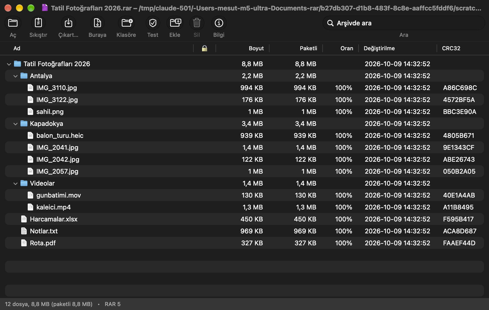
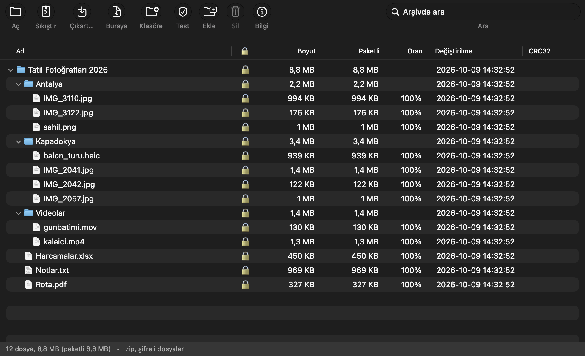
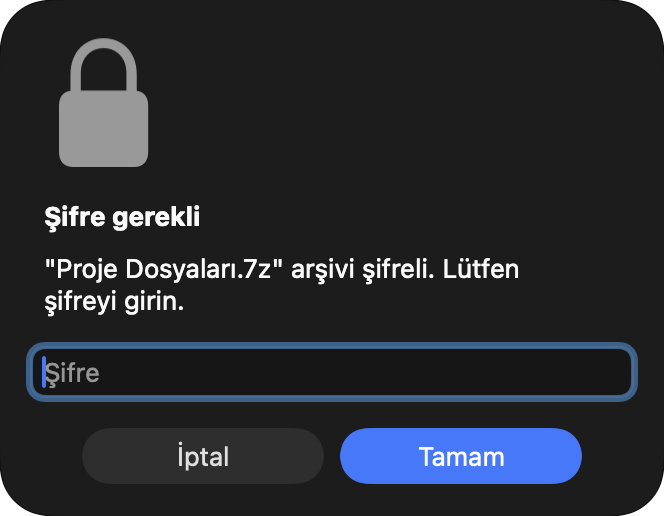
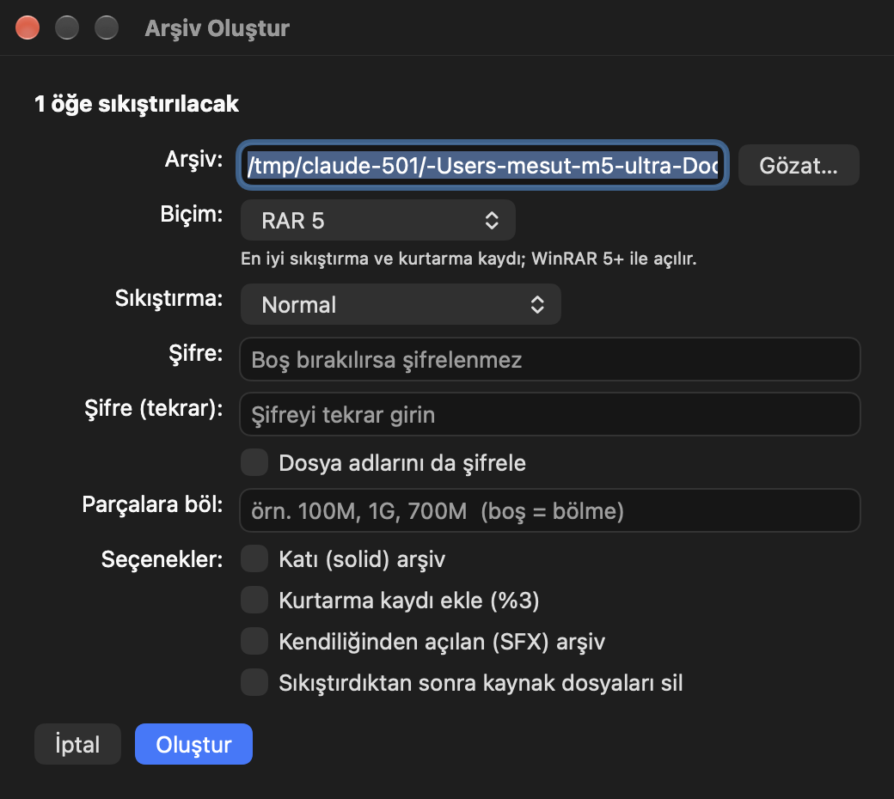

<p align="center"></p>

<h1 align="center">MacRAR</h1>

<p align="center">macOS için WinRAR tarzı arşiv yöneticisi. RARLAB'ın resmi <code>rar</code>/<code>unrar</code> komut satırı araçlarını ve 7-Zip'in resmi <code>7zz</code> aracını yerel (AppKit) bir Mac uygulamasında birleştirir.</p>

<p align="center"><a href="README.md">🇬🇧 English</a></p>

---

## Neden

macOS'ta `.rar` dosyalarını açacak yerleşik bir araç yoktur; mevcut uygulamalar ise şifreli ya da çok parçalı arşivlerde zorlanır. MacRAR bu iş için var olan en iyi iki motoru, RARLAB'ın `unrar`/`rar` ikilisini ve Igor Pavlov'un `7zz` aracını, Windows'taki WinRAR gibi davranan küçük bir yerel uygulamaya sarar: çift tıklayıp içeriğe bakarsınız, Finder'da sağ tıklayıp çıkartır veya sıkıştırırsınız, arşiv penceresinden dosyaları sürükleyip çıkarırsınız, şifre yalnızca gerçekten gerektiğinde sorulur.

Uygulama yaklaşık 2.000 satır Swift'tir, Xcode projesi gerektirmez (Command Line Tools yeterlidir) ve üçüncü taraf kütüphane kullanmaz.

## Ekran görüntüleri

| RAR arşivi görüntüleme | Şifreli ZIP (kilit sütunu) |
|---|---|
|  |  |

| Şifre sorusu | Arşiv oluşturma penceresi | Detaylı ilerleme penceresi |
|---|---|---|
|  |  |  |

## Desteklenen biçimler

| İşlem | Biçimler |
|---|---|
| Açma / çıkartma / test | RAR (tüm sürümler, çok parçalı `.partN.rar`), ZIP/ZIPX, 7z (`.7z.001` parçalı dahil), TAR, GZ/TGZ, BZ2, XZ, ZST, LZ4, LZMA, Z, CAB, ARJ, LZH, CPIO, ISO, WIM, DEB, RPM, JAR/APK, MSI, CHM, XAR/PKG, DMG, VHD/VMDK ve 7-Zip'in okuduğu diğer biçimler |
| Oluşturma | RAR 5, RAR 4, 7z, ZIP, TAR, TAR.GZ, TAR.XZ, TAR.BZ2 |
| Ekleme / silme | RAR, 7z, ZIP, TAR (tar.gz türevlerinde desteklenmez) |
| Şifre | RAR ve 7z: içerik + dosya adları (AES-256); ZIP: içerik (AES-256) |

`.rar` dosyaları için `unrar`/`rar`, diğer her şey için `7zz` kullanılır. `tar.gz` türü arşivler iki aşamalı boru hattıyla (dış katman → iç tar) açılır.

## Özellikler

- **Arşiv görüntüleme:** Arşivi çift tıklayınca içeriği klasör ağacı olarak açılır (ad, şifreli işareti, boyut, paketli boyut, oran, tarih, CRC). Sütun başlığına tıklayarak sıralanır; genişlikler ve sıralama hatırlanır.
- **Klavye ve menüler:** Return ile seçili dosya açılır, Space ile Hızlı Bakış önizlemesi gelir; Görünüm menüsünde Tümünü Genişlet/Daralt, Yenile ve Arşivi Finder'da Göster; Dosya → Son Kullanılanlar.
- **Ayarlar (⌘,):** Hızlı sıkıştırma için varsayılan biçim ve düzey, çıkartma/sıkıştırma sonrası Finder'da gösterme, güncelleme denetimi, arayüz dili.
- **Şifreli arşivler:** İçeriği şifreli ve dosya adları şifreli arşivler desteklenir. Şifre gerektiğinde sorulur, yanlışsa tekrar sorulur.
- **Çıkartma:** Buraya çıkart (⌘E), arşiv adıyla klasöre çıkart (⌥⌘E), şuraya çıkart… (⇧⌘E), yalnızca seçilenleri çıkart. Hedefte aynı adlı dosya varsa üzerine yaz / yeniden adlandır / iptal sorulur.
- **Sıkıştırma:** Biçim seçimi (RAR5/RAR4/7z/ZIP/TAR/TAR.GZ/TAR.XZ/TAR.BZ2), 6 sıkıştırma düzeyi, şifre (isteğe bağlı dosya adlarını da şifreleme), katı arşiv, kurtarma kaydı, parçalara bölme, SFX, kaynakları silme. Biçimin desteklemediği seçenekler otomatik kapanır.
- **Finder'a sürükleyerek çıkartma:** Arşiv penceresindeki öğeleri bir Finder klasörüne veya masaüstüne bırakın; MacRAR bir kez sorar, onaylarsanız öğeleri ilerleme penceresiyle oraya çıkartır.
- **İlerleme penceresi:** Toplam yüzde, tahmini kalan süre, geçen süre, işlenen dosya ve "Detayları Göster" ile açılan dosya listesi.
- **Çok parçalı arşivler:** `.part01.rar … .partNN.rar` ve `.7z.001 … .NNN` setleri tanınır; Finder'da tüm parçaları seçseniz bile set bir kez, ilk parçadan başlayarak işlenir.
- **Diğer:** Arşivi test et (⌘T), arşive dosya ekle (⇧⌘A), arşivden sil (⌘⌫), arşiv bilgisi (⌘I), arşiv içinde arama, dosyayı çift tıklayıp doğrudan açma, pencereye arşiv sürükleyip açma, pencereye dosya sürükleyip arşive ekleme.
- **Güncelleme:** Uygulama günde bir kez GitHub Releases'ı denetler, yeni sürüm varsa indirmeyi önerir; *MacRAR → Güncellemeleri Denetle…* ile elle de denetlenir. `MACRAR_NO_UPDATE_CHECK=1` ile kapatılabilir.
- **Dil:** Arayüz sistem diline göre Türkçe veya İngilizce açılır (Sistem Ayarları → Genel → Dil ve Bölge'deki uygulamaya özel dil seçimi de dikkate alınır). `MACRAR_LANG=tr|en` ile zorlanabilir.
- **Finder sağ tık menüsü:** Arşiv seçiliyken doğrudan menüde "MacRAR ile Aç", "MacRAR: Buraya Çıkart", "MacRAR: Klasöre Çıkart"; her türlü seçimde "MacRAR ile Sıkıştır…" görünür. "Hızlı Eylemler" alt menüsünde ise "MacRAR • Şuraya Çıkart…", "MacRAR • Test Et" ve soru sormadan RAR oluşturan "MacRAR • Sıkıştır (RAR)" bulunur.

## İndirme

Developer ID ile imzalı ve Apple tarafından notarize edilmiş hazır sürümler [Releases sayfasında](https://github.com/mstcvk/MacRAR/releases/latest): DMG'yi açın, MacRAR'ı Uygulamalar klasörüne sürükleyin, bir kez çalıştırıp *MacRAR → Finder Hızlı Eylemlerini (Yeniden) Yükle* komutunu verin. Gatekeeper uyarısı çıkmaz.

## Gereksinimler

- macOS 13 Ventura veya üstü, Apple Silicon (ikililer arm64'tür; Intel için x64 sürümlerini indirip yeniden derleyin).
- Xcode Command Line Tools (`xcode-select --install`). Tam Xcode gerekmez.
- RAR arşivi *oluşturmak* için WinRAR lisansı. Paketlenen `rar` RARLAB'ın 40 günlük deneme sürümüdür; `unrar` ile RAR açma, çıkartma ve test süresiz ücretsizdir. 7z/ZIP/TAR oluşturma `7zz` ile yapılır ve ücretsizdir.

## Derleme ve kurulum

```bash
git clone https://github.com/mstcvk/MacRAR.git
cd MacRAR
./fetch-tools.sh      # rar/unrar ve 7zz'yi rarlab.com ve 7-zip.org'dan tools/ klasörüne indirir
./build.sh install    # derler, /Applications/MacRAR.app olarak kurar, Finder hızlı eylemlerini yükler
```

Yalnızca derlemek için `./build.sh` (çıktı: `build/MacRAR.app`). Kurulum adımı çalışan bir MacRAR'ı asla kapatmaz; devam eden bir çıkartma varsa uygulamanın kapanmasını bekler.

`rar`, `unrar` ve `7zz` ikilileri bu depoda **bulunmaz**; `fetch-tools.sh` onları resmi kaynaklarından indirir, böylece lisansları sahiplerinde kalır.

.rar dosyaları için varsayılan uygulama yapmak: uygulama menüsünden **"RAR Dosyaları İçin Varsayılan Uygulama Yap"**; ZIP, 7z, TAR vb. için **"Tüm Arşivler İçin Varsayılan Yap"** veya Finder'da bir .rar dosyasına sağ tık → Bilgi Al → Birlikte Aç → MacRAR → Tümünü Değiştir.

Hızlı eylemler Finder menüsünde görünmezse: Sistem Ayarları → Genel → Oturum Açma Öğeleri ve Uzantılar → Finder (Hızlı Eylemler) altından etkinleştirin.

## İmzalı dağıtım (release.sh)

`build.sh` yalnızca bu Mac'te çalışan ad-hoc imzalı bir uygulama üretir. Başka Mac'lerde Gatekeeper uyarısı çıkmaması için `release.sh` uygulamayı Developer ID sertifikasıyla imzalar, Apple notarize servisine gönderir, onay damgasını ekler ve `dist/MacRAR-<sürüm>.zip` üretir. Gerekenler: Apple Developer Program üyeliği, "Developer ID Application" sertifikası (Xcode → Settings → Accounts → Manage Certificates…) ve bir `notarytool` anahtar zinciri profili:

```bash
xcrun notarytool store-credentials MacRAR --apple-id siz@ornek.com --team-id EKIPKIMLIGI
./release.sh
```

## Komut satırı modları

Hızlı eylemler uygulamayı şu şekilde çağırır:

```bash
open -n -a /Applications/MacRAR.app --args --extract-here /yol/arsiv.rar
```

Desteklenen bayraklar: `--extract-here`, `--extract-folder`, `--extract-to`, `--test`, `--compress`, `--compress-dialog`, `--set-default`, `--install-quick-actions`.

## Dosya yapısı

- `Sources/RarEngine.swift` – rar/unrar/7zz çalıştırma, biçim algılama, `unrar lt` ve `7zz l -slt` çıktılarını ayrıştırma, boru hattı ve ilerleme takibi
- `Sources/Operations.swift` – çıkart / test / sıkıştır / ekle / sil işlemleri, şifre döngüsü
- `Sources/ArchiveWindow.swift` – ana pencere, ağaç görünümü, araç çubuğu, sürükle-bırak
- `Sources/Dialogs.swift` – şifre, ilerleme ve sıkıştırma seçenekleri pencereleri
- `Sources/QuickActions.swift` – Finder hızlı eylem (.workflow) üretimi
- `Sources/AppDelegate.swift`, `Sources/main.swift` – uygulama yaşam döngüsü, menüler, komut satırı modu
- `makeicon.swift` – uygulama simgesi üreteci

## Geliştirici notları

Otomatik test için ortam değişkenleri (ekran kaydı izni gerektirmez):

| Değişken | Etkisi |
|---|---|
| `MACRAR_LANG=en` / `tr` | arayüz dilini zorlar |
| `MACRAR_SNAPSHOT=/yol/önek` | `MACRAR_SNAPSHOT_DELAY` saniye sonra (varsayılan 2) açık pencereleri `önek-N.png` olarak kaydedip çıkar |
| `MACRAR_DEBUG_PASSWORD=…` | şifre sorularını otomatik yanıtlar |
| `MACRAR_DEBUG_CONFIRM=1` | onay pencerelerini varsayılan düğmeyle yanıtlar |
| `MACRAR_DEBUG_DETAILS=1` | ilerleme penceresini detay listesi açık başlatır |
| `MACRAR_DEBUG_FORMAT=zip` | `--compress` için biçim (`7z`, `zip`, `tar`, `tar.gz`, `tar.xz`, `tar.bz2`, `rar`) |
| `MACRAR_DEBUG_DRAG=/klasör` | açılan arşivin ilk öğelerini o klasöre sürüklemiş gibi davranır |

## Üçüncü taraf yazılımlar

- **RAR / UNRAR** © Alexander Roshal, RARLAB. `unrar` ücretsizdir; `rar` deneme sürümüdür. Bkz. [rarlab.com](https://www.rarlab.com).
- **7-Zip** © Igor Pavlov, GNU LGPL (unRAR kısıtlamasıyla) ve bazı bölümler için BSD 3-clause lisansı. Bkz. [7-zip.org](https://www.7-zip.org).

## Geliştirici

**Mesut Çevik** · [github.com/mstcvk](https://github.com/mstcvk)

## Lisans

MacRAR kaynak kodu [MIT Lisansı](LICENSE) ile yayımlanmıştır.

## Notlar

- Uygulama RARLAB'ın `rar` ikilisini kullanır; `rar` deneme sürümüdür (40 gün), `unrar` ücretsizdir. RAR çıkartma/görüntüleme için lisans gerekmez, RAR oluşturma için WinRAR lisansı gerekir. 7z/ZIP/TAR oluşturma `7zz` ile yapılır ve tamamen ücretsizdir (LGPL).
- Uygulama ad-hoc imzalıdır (yalnızca bu Mac'te çalışır). Başka bir Mac'e taşımak için orada yeniden derleyin.
